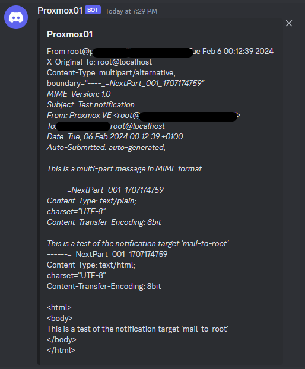

# Proxmox to Discord Notifications
Made a very simple, hacky way of getting my Proxmox server mail notifications to Discord, as I did not want to deal with setting up SMTP or use a relay service for it from my home. 

Make sure the emails from proxmox are always going to root@localhost.

Tested on Proxmox 8.1 with Debian 12. 

## Setup Discord
1. Make a channel in your Discord, or use an already existing one.
2. Click the cogwheel and click edit settings.
3. Go to integrations.
4. Click webhooks and click Create Webhook.
5. Click the new Webhook, give it a name and make sure the right channel is selected.
6. Assign it an icon if you wish.
7. Click Copy Webhook URL.

## install package
1. Install the jq package via `apt-get update && apt-get install jq -y`

## Script setup
1. Copy the script to your /usr/bin/ directory.
2. vim or nano into the script, paste the Webhook URL in the "WEBHOOK_URL" variable.
3. Change the SERVERNAME if you wish.
4. Save the file.
5. Run `chmod +x discord.sh` (change discord.sh if you saved it as different name.

## Modify /root/.forward
1. vim or nano into `/root/.forward`.
2. add `|/usr/bin/discord.sh` to a new line.
3. Save file.

Use at your own risk. 

